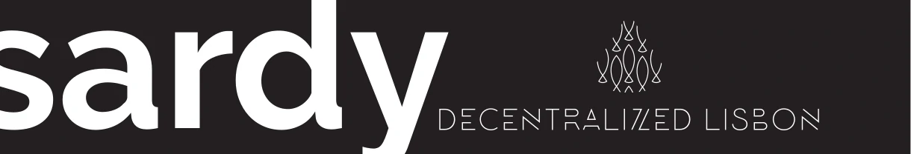

    

> Sardy - a sardinha descentralizada 🐟

A todos os nossos novos membros, da-mos aqui as boas vindas. Obrigado por se terem juntado, obrigado por fazerem parte de um movimento muito maior do que qualquer um de nós. Este é um meetup onde queremos partilhar conhecimento, experiências e ensinar sobre as novas tecnologias que estão a surgir na área de blockchain. Por ser uma área tão vasta, sentimo-nos obrigados a reduzir a alguns tópicos.

Mas não nos ficamos só pelo meetup. Visitando o [nosso website descentralizado](https://dlx.netlify.com/), vão conseguir encontrar muitas mais coisas. Desde desafios, material de aprendizagem, publicações feitas pelos nossos membros, entre outras coisas.

Não somos nenhuns radicais. Cada um tem as suas ideologias. Pretendemos partilhar conhecimento e experiências. Não influenciar pessoas a comprar cripto, hipotecando a casa.

Se tens alguma curiosidade sobre algum tópico, envia-nos mensagem com as tuas sugestões. Ou participando num meetup. Esperamos que te sintas confortável.

Mais uma vez obrigado e até breve 👋.
